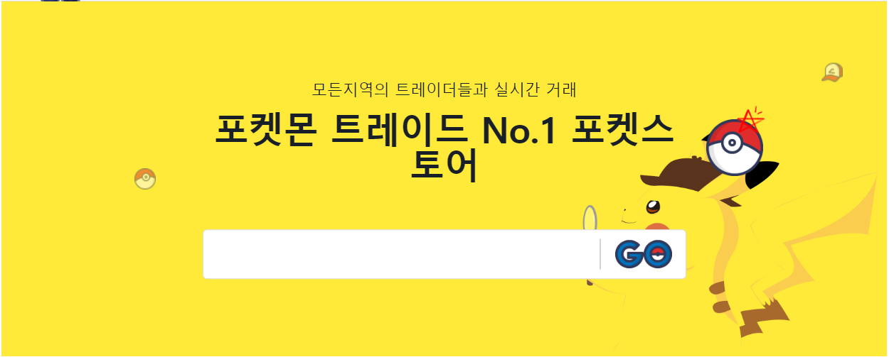
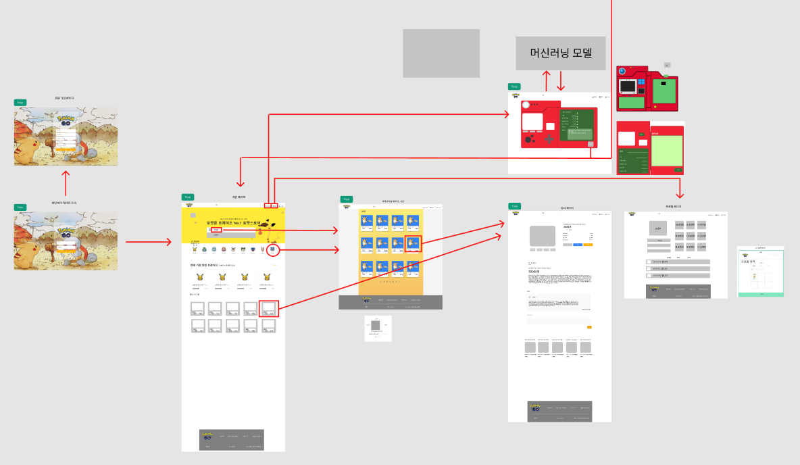

#  포켓몬 장터
***

 
 

###  소개 
***

포켓몬 이미지를 올리기, 판매, 수집 할 수 있는  중고 거래 사이트!

 
 

### 사용한 기술 
***

 

 
 

### 프로젝트 세팅
***
* 가상환경 : `Anaconda`

* Packages 

  - `Flask` `dnspython` `pymongo` `requests` `PyJWT` `Tensorflow`

 
 

### 프로젝트 기간
***
### 2022 년 1월 13일 ~ 2022년 1월 18일 [약 1주]

 
 

### 팀 구성 및 역할 
***

 

김재성 : `팀장` / `공통 백엔드` / `머신러닝`/ `카테고리페이지` /  `글 쓰기 페이지`

김호 님 :  `백엔드` / `로그인페이지` / `이미지 디자인`

이성오님 : `프론트` / `회원 가입 페이지`/ `메인 페이지`/ 

문경민님 :  `프론트`  / `헤 더` / `상세 페이지` / `파레트`/ `전체적인 CSS  `

정심일  : `프론트`  / `푸 터` / `개인 프로필 사진`/

 
 

### 주요기능
***

* 포켓몬 게시글 올리기
* AI 를 통한 이미지 카테고리 분류
* 댓글 기능
* 카테고리별 페이지

 
 

### 와이어 프레임
***

[Figma 링크](https://www.figma.com/file/MrPWIagiukBUsmXkD9aqJm?embed_host=share&kind=&viewer=1)

 
 

### AI code
***

* AI 학습은 Colab 에서 진행 
* 예제 코드 활용
* 학습 데이터 = Keggle Pokenmon data + random pokemon Image
* CNN 을 이용
* Optimazier - SGD 사용
* [코드 보기 - 클릭](https://colab.research.google.com/drive/1yTLzyxISHTPDeRQ0qLChB8lVTdfdon8R?usp=sharing) 

 
 

### DB
***

Collections 

* category 
  * poket_categroy : Array

 

* market
  * maket_id : `<string>`
  * user_id : `<string>`
  * content : `"<string>`
  * comment : `Array `
  * category : `<string>`
  * photo : `<string>`
  * desc : `<string>`
  * header : `<string>`
  * date : `<string>`
  * price : `<string>`
  * level : `<string>`
  * like_feed : `<string>`
  * catch_location : `<string>`
  * trade_location : `<string>`
  * like : `<int>`
  * like_list : `Array`

 

* users
  * avatar:`<string>`
  * user_id:`<string>`
  * password : `<string>`
  * phone_number :`<string>`
  * gender : `<string>`
  * interest_poket : `<string>`
  * point : `<int>`
  * poket_box : `Array`

 
 

***
## [포켓몬 Notion 보기!](https://quartz-laborer-e78.notion.site/sparta-4-0b2c834274b6424ba5c727555d6b1952)
*** 